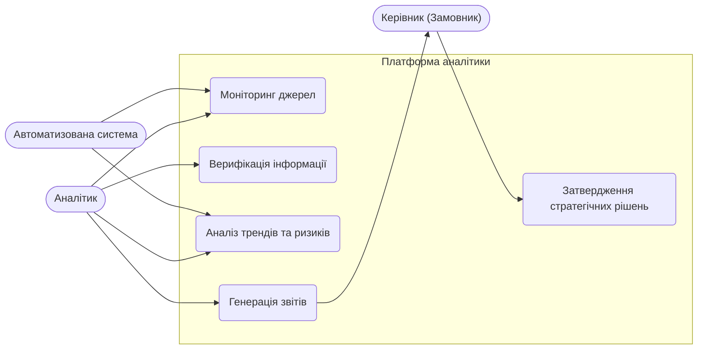
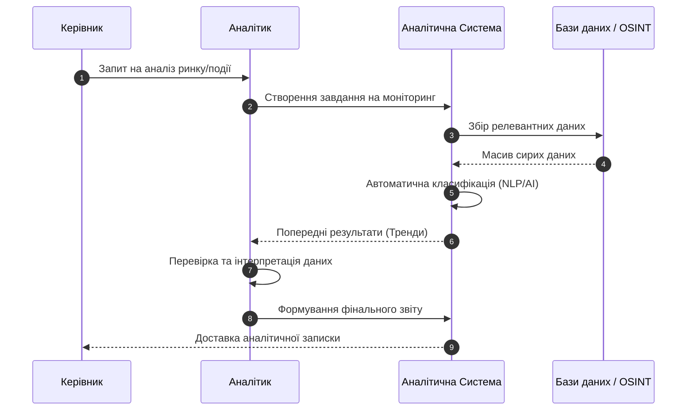
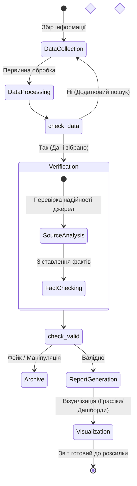

# Практична робота: Побудова поведінкових UML-діаграм
**Тема:** Проєктування системи автоматизації інформаційно-аналітичної діяльності (Information & Analysis System)

## Опис проєкту
Система призначена для автоматизації циклу аналітичної роботи: від моніторингу первинних джерел інформації до генерації фінальних аналітичних записок для керівництва. Вона дозволяє систематизувати великі масиви даних, виявляти тренди та забезпечувати верифікацію інформації.

**Основні етапи роботи системи:**
1.  Агрегація даних з відкритих джерел (OSINT), баз даних та ЗМІ.
2.  Інтелектуальний аналіз та класифікація контенту.
3.  Формування звітів та візуалізація аналітики.

---

## 1. Діаграма варіантів використання (Use Case Diagram)
Відображає взаємодію Аналітика, Системи та Керівника (Decision Maker) із функціоналом платформи.

---

## 2. Діаграма послідовності (Sequence Diagram)
Описує процес створення термінової аналітичної довідки за запитом.

---

## 3. Діаграма діяльності (Activity Diagram)
Візуалізує логіку обробки інформації: від отримання даних до прийняття рішення про їхню публікацію у звіті.

---
**Інструмент моделювання:** Mermaid.js  
**Галузь застосування:** Інформаційна безпека, бізнес-аналітика, державне управління.
